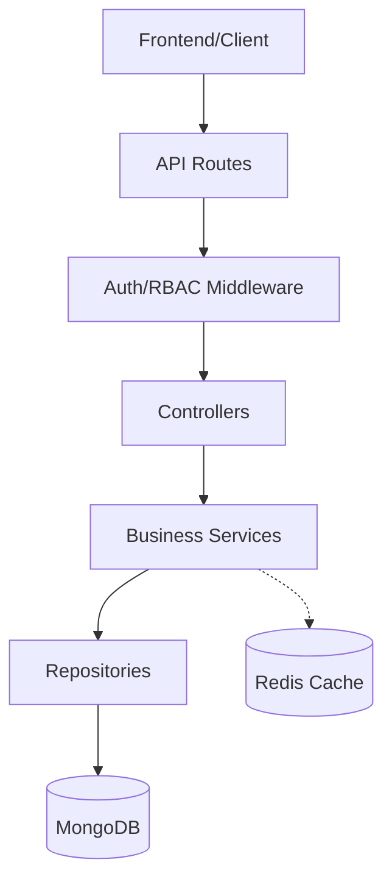

# Healthcare Blood Donation Service - Auth, RBAC & Donation System

A production-ready blood donation management system built with Node.js, Express, TypeScript, and MongoDB.

## 🚀 Features

- **User Profiles**: Comprehensive user records with `bloodGroup`, `dateOfBirth`, and `location`.
- **Blood Request System**: Full lifecycle management of blood requests from creation to fulfillment.
- **Admin Management**: Dedicated admin routes to view and approve blood requests.
- **Volunteer System**: Users can accept/volunteer for approved blood requests.
- **JWT Auth**: Secure implementation of Access Tokens (15m) and Refresh Tokens (7d).
- **RBAC**: Protected routes based on roles (`ADMIN`, `USER`).
- **Swagger Documentation**: Interactive API testing playground at `/api-docs`.
- **Clean Architecture**: Separation of concerns using Controller -> Service -> Repository layers.

## 🛠️ Tech Stack

- **Runtime**: Node.js
- **Framework**: Express.js
- **Language**: TypeScript
- **Database**: MongoDB (via Mongoose)
- **Cache/Queue**: Redis (for batch operations)
- **Security**: JWT, Bcrypt
- **Documentation**: Swagger UI

## 📂 Project Structure

```text
src/
├── config/       # Database and Swagger configuration
├── controllers/  # Request handling logic
├── middlewares/  # JWT verification and RBAC
├── models/       # Mongoose schemas (User, BloodRequest)
├── repositories/ # Database abstraction layer
├── routes/       # API route definitions
├── services/     # Business logic
├── utils/        # JWT signing and helper functions
├── app.ts        # Express app setup
└── server.ts     # Entry point
```

## 🏗️ Architecture & Workflow

The system follows a **Clean Architecture** pattern to ensure maintainability and scalability.

### Data Flow Pattern


### Layer Responsibility
- **Routes**: Defines endpoints and attaches appropriate middleware.
- **Middlewares**: Handles JWT verification and Role-Based Access Control (RBAC).
- **Controllers**: Parses request body/params, calls services, and returns HTTP responses.
- **Services**: Contains core business logic (e.g., batching logic, validation).
- **Repositories**: Standardizes database queries (Mongoose) to keep services database-agnostic.
- **Models**: Defines the data schema using Mongoose.

### Batch Approval Workflow
1. **Admin Selection**: Admin selects multiple requests. Each selection calls the `toggle-approval` API.
2. **State Management**: Redis stores the `requestId` in a Hash Set tied to the `adminId`.
3. **Execution**: When "Approve All" is clicked, the `batch-approve` API fetches all IDs from Redis and processes them in parallel using `Promise.allSettled`.
4. **Cleanup**: Once processed, the Redis batch is cleared for that admin.

## ⚙️ How it Works

### 1. Registration
Users register with full profile details. The system uses these profiles to match donors with blood requests.

### 2. Blood Request Lifecycle
1. **Creation**: A user creates a request via `POST /blood-requests`.
2. **Review**: Admins can view all pending requests.
3. **Approval**:
   - **Single Approval**: Admin approves a request via `PATCH /admin/blood-requests/:id/approve`.
   - **Batch Approval**: Admin adds multiple requests to a batch via `PATCH /admin/blood-requests/:id/toggle-approval` and then approves all in one go via `POST /admin/blood-requests/batch-approve`.
4. **Acceptance**: Once approved, volunteers can accept the request via `PATCH /blood-requests/:id/volunteer`.
5. **Fulfillment**: The request status is updated to `FULFILLED` upon acceptance.

## 🏁 Getting Started

### Prerequisites
- Node.js installed
- MongoDB running locally or a connection string
- Redis server running locally (port 6379)

### Installation

1. Install dependencies: `npm install`
2. Configure `.env` (see below)
3. Build: `npm run build`
4. Start: `npm start`
5. Debug: Press F5 in VS Code (Pre-configured `launch.json`)

### Environment Variables
```env
PORT=5000
MONGODB_URI=your_mongodb_uri
JWT_SECRET=your_access_secret
JWT_REFRESH_SECRET=your_refresh_secret
ACCESS_TOKEN_EXPIRY=15m
REFRESH_TOKEN_EXPIRY=7d
REDIS_URL=redis://localhost:6379
```

## 📡 API Endpoints

### Authentication
| Method | Endpoint | Description | Access |
| :--- | :--- | :--- | :--- |
| POST | `/auth/register` | Register with profile details | Public |
| POST | `/auth/login` | Login and get tokens | Public |
| POST | `/auth/refresh` | Get new access token | Public |

### Blood Requests
| Method | Endpoint | Description | Access |
| :--- | :--- | :--- | :--- |
| POST | `/blood-requests` | Create a blood request | Authenticated |
| GET | `/blood-requests` | View all requests | Public |
| PATCH | `/blood-requests/:id/volunteer` | Volunteer for a request | Authenticated |

### Admin Operations
| Method | Endpoint | Description | Access |
| :--- | :--- | :--- | :--- |
| GET | `/admin/blood-requests` | View all requests | Admin Only |
| PATCH | `/admin/blood-requests/:id/approve` | Approve a single request | Admin Only |
| PATCH | `/admin/blood-requests/:id/toggle-approval` | Add/Remove request from batch | Admin Only |
| POST | `/admin/blood-requests/batch-approve` | Approve all batched requests | Admin Only |

### User Profile
| Method | Endpoint | Description | Access |
| :--- | :--- | :--- | :--- |
| GET | `/users/profile` | Get full user profile | Authenticated |

## 🧪 Interactive Docs
Access the Swagger UI at: `http://localhost:5000/api-docs`

